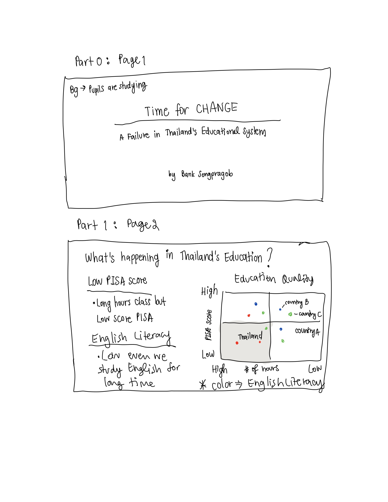
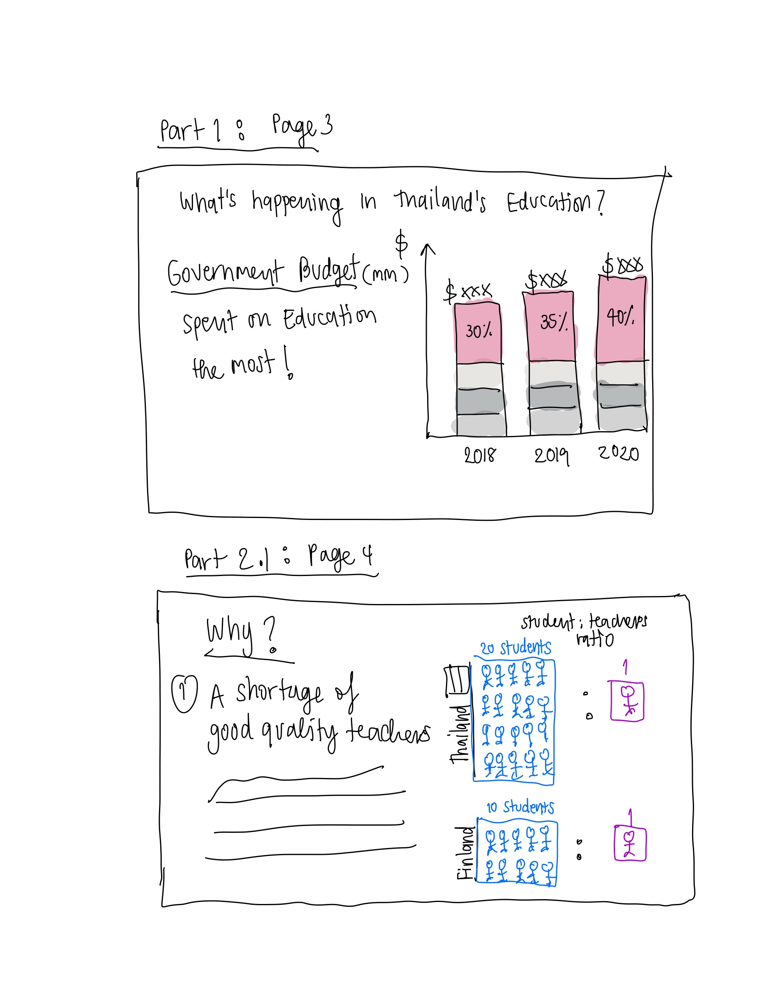
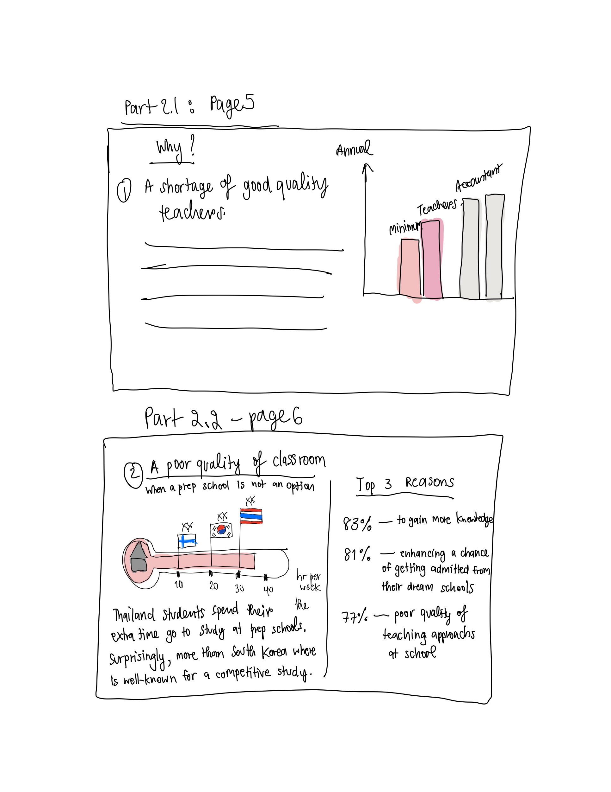
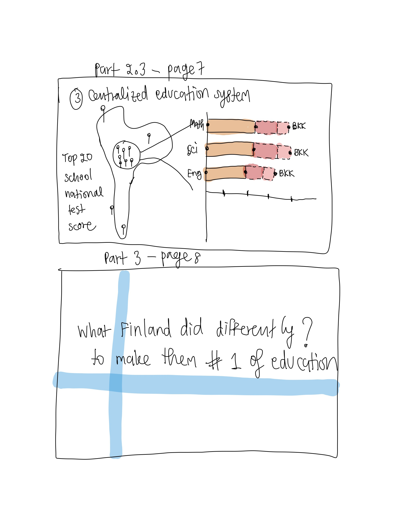
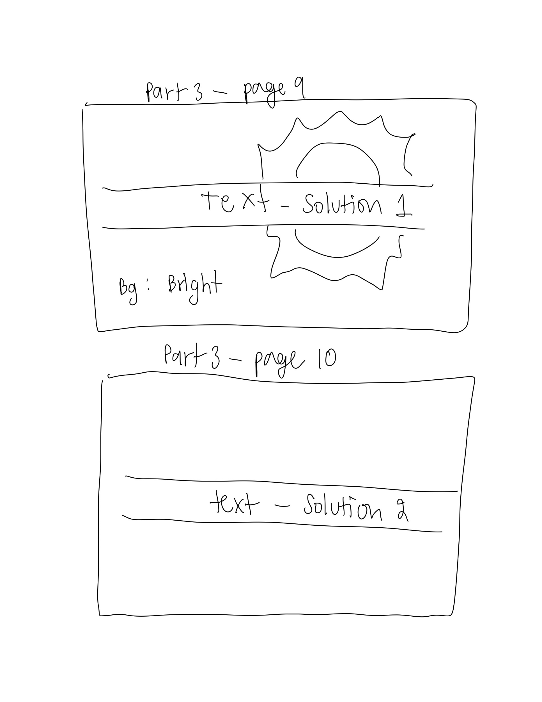
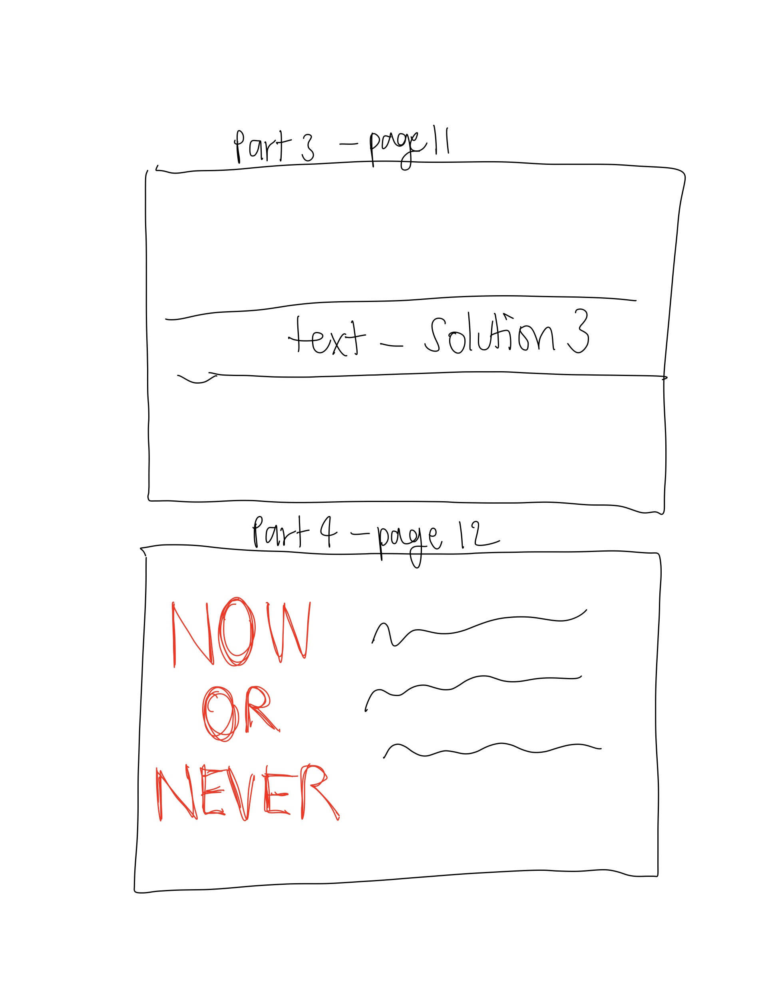

# Outline

*Time to CHANGE: A failure in Thailand's Education*

Thailand's high school students struggled with the unstructured and poor quality of the university admission

What I want to achieve is to call out the awareness and movement to change the current Thailand Educational Sysytem.

My target group is to the current high school Thai students who are suffering from the system, their parents who have no idea what their children are facing but may blaim them when the result is unpleasant, and general Thai people who wants to see the better future of Thailand because this current students would become the next generation of Thailand leaders.

*Outline*

I will break into 3 parts.

Part 1: Problem identification - shows how Thailand (poor) perform compared to other countries in terms of education quality to provoke the reader's thought that "Thailand education is problematic" and "Why?"
I will display the PISA score of Thailand compared to an average PISA score, English literacy, and the reverse relationship between the long class hour and the student's performance.

Another point is the biggest portion of government spending goes with the educational department. However, the global presence of Thailand is bad.
These 3 support the consequence of poor quality Thailand's educational system.

Part 2: Why? These are the reasons...

3.1 Teacher - Schools in Thailand requires theie teacher applicants to have a bachelor degree in Education (major in the subject they teach such as Maths, Physics etc.)
We are facing a shortage of teacher supplies (a ratio between teacher and student is 1:21 compared to 1:10 in Finland where is the best education in the world.), while the clas size is around 40 students per class.
A key reason of lacking teacher is because the remuneration is not appealing. You can see that the average starting salary of Thailand teacher is higher than the minimum wage 50% (teacher = 180k/ minimum wage = 120k).

The charts that I will create.

(1) Ratio between students and teacher: 21 people figure coloring blue representing students and 1 people figure for teacher.

(2) Class size: 40 people figure coloring blue again but will have a square surrounded to represent a classroom (if possible)

(3) A big number of teacher annual salary compared with minimum wage and other careers (engineers, accountants etc.) to show that "teacher" is not a pleasant or well-paid job.

3.2 Poor quality teaching approaches: I want to highlight that even though there is no direct measurement of how poor quality the classroom is, we can see the consequence by looking at the time spent at the prep schools. The survey showed that Thai students spend their time at prep school higher than Korean students which are well-known for studying hard and competitive. Also, another survey showed that the top 3 reasons why students want to go to prep schools: (1) they want to gain more knowledge, (2) they think that prep school can enhance a chance to getting admitted, and (3) teachers at school fails at teaching. 

The charts that I will create.

(1) The thermometer chart to show the 3 countries comparison of time spending at prep school

(2) The percentage number of top 3 reasons.

3.3 Centralized educational system - All top tier schools and top prep schools are located in Bangkok province, a capital of Thailand. We can see that the top 20 schools ranking by the national test score are located in Bangkok.
Morevoer, the national test score from school in Bangkok is higher than other schools. Therefore, pupils in the marginalized area were disadvantaged to get a higher degree by default.

(1) Geography map to show that the top school is concentrated in the capital.

(2) A bar chart to compare between the average national test score amoung the region (Bangkok, Central, North, West, East, South) and area (urban, suburban) to highlight that the education is concentrated at capital.

Part 3: Summary
I will provide an example of Finland - the best education country in the world to see what did they differently from Thailand. And I will end up with the emotional quote to call for the awareness to *CHANGE*

# Sketching

# Data
Part 1: 

- PISA score test: https://www.oecd.org/pisa/data/2015database/

- English literacy: https://www.ef.com/wwen/epi/

- Re3lationship between class time and PISA score: https://www.oecd-ilibrary.org/docserver/744d881a-en.pdf?expires=1614031186&id=id&accname=guest&checksum=A8F3EC624B612CC77DEDB4193D50E33C and https://pisathailand.ipst.ac.th/issue-2019-46/

- Government spending: https://www.eef.or.th/%E0%B8%9A%E0%B8%B1%E0%B8%8D%E0%B8%8A%E0%B8%B5%E0%B8%A3%E0%B8%B2%E0%B8%A2%E0%B8%88%E0%B9%88%E0%B8%B2%E0%B8%A2%E0%B8%81%E0%B8%B2%E0%B8%A3%E0%B8%A8%E0%B8%B6%E0%B8%81%E0%B8%A9%E0%B8%B2/

- Government spending: https://news.thaipbs.or.th/content/285252

Part 2:

2.1 Teacher dimension

- Global teacher salary OECD (page 422-423): https://read.oecd-ilibrary.org/education/education-at-a-glance-2016_eag-2016-en#page423

- Thailand's teacher salary: http://web.krisdika.go.th/data/law/law2/%A709/%A709-20-9999-update.pdf

- A ratio between teacher and students: http://statbbi.nso.go.th/staticreport/page/sector/en/03.aspx

- Number of students per classroom: http://www.eduwh.moe.go.th/

2.2 Quality of teaching appraoch

- Time Class by country: https://www.oecd-ilibrary.org/docserver/744d881a-en.pdf?expires=1614031186&id=id&accname=guest&checksum=A8F3EC624B612CC77DEDB4193D50E33C

- Survey top 3 reasons: https://www.dailynews.co.th/education/367435

2.3 Centralized educational system

- Percentage of higher education: http://edu.kps.ku.ac.th/DBresearch/document/1/1634-file.pdf

- National test score by region: http://www.admissionpremium.com/uploads/contents/2020032743453.pdf

- National test score by school and by subject: https://drive.google.com/file/d/1-SXlHyWqMGKubF1nBIDiiYHIaffdX6dI/view?fbclid=IwAR2oPrme2X9ASYwKIxKsBDY6M_6_W2IguYsljDgZWs-O5JS9snVxUCr4hNE

- Finland quote: https://minedu.fi/en/-/opetusministeri-andersson-pisa-tuloksista-suomessa-oma-lahikoulu-on-maailman-parhaimpien-joukossa

Part 3: Look at the good example

- Finland: https://minedu.fi/en/-/opetusministeri-andersson-pisa-tuloksista-suomessa-oma-lahikoulu-on-maailman-parhaimpien-joukossa

- Finland: https://www.weforum.org/agenda/2018/09/10-reasons-why-finlands-education-system-is-the-best-in-the-world

# Method and Medium

I will use a Shorthand as my mean to complete the project. Each page/chart will be visualized by flourish and Tableau. All of my visualization are charts and text. I think that would be sufficient for my readers because I want to make the mood and tone professional and simple but serious at the same time. Therefore, a Shorthand would be perfect as the way to present my visualization.
