# Wireframes and storyboard

You can also see my wireframes and storyboard below or [Click here to see my presentation] (https://shorthand.com/organisations/NYRYorwlO0/stories/hM7ufPGk7N).

I broke down into 3 parts

Part 1: Introduction
I gave the introduction with the dark background to draw the mood down and highlight the seriousness. I used the phrases "Did you know?" to draw the audience's attention. 

The first visualization was about the global presence of Thailand in terms of the educational performance and time spending. I highlight the red area to represent that Thailand has been in the low performance with the long time spending, implying that the uneffectiveness in education system. Not to mention, the red dot represented the very low English proficiency. Red represents something wrong, while other dots are colored gray to make the red dot more clearly.

The second visualization represented the average spending on education to eliminate the argument of insufficient government spending because Thailand spent around approximately to the OECD average. Therefore, there is something else that causes the failure in education system.

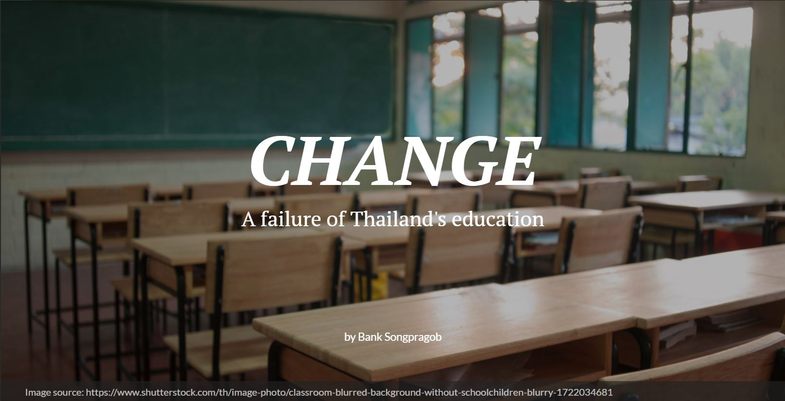

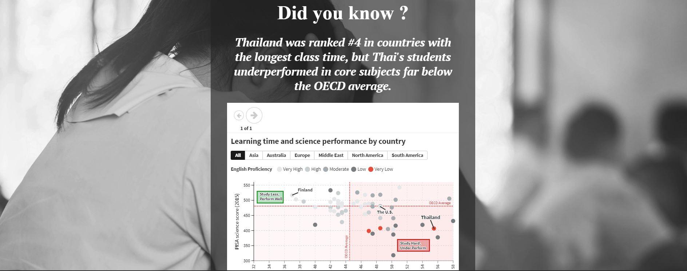

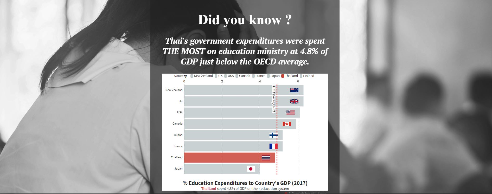

Part 2: What makes Thailand fail in the education?

In this part, I still used the dark theme to highlight the root cause of this problem. 

1) Good qualified teachers are shortage - I used the human icon visualization to compare the number of students that teacher from both countries have to take a responsibility. This showed that Thailand's teacher is working so hard to take care 4 times to Finland. Moreover, I would like to dig deeper that the low paid salary is the key by comparing with other top 2 careers (flight attendants and general company officers). I used the box plot to see the range of salary.

2) Failure in school classroom - This data visualization highlighted that the quality of school lectures is poor. I started with the quote to say that the prep school is the result of the poor quality classroom. The data also supported the key meesage that most students go for the prep schools because they don't understand the lecture from the class and because the school cannot provide the sufficient knowledge for college national exam.

3) Centralized the education system - The data visualization on the right side showed that students from Bangkok got a higher score than students from other provinces in all core subjects. This is because Thailand centralized all educational resources and funding to Bangkok. The geography visualization showed the large portion of poor students. You will see that that the yellow color represents a few percentage of students.

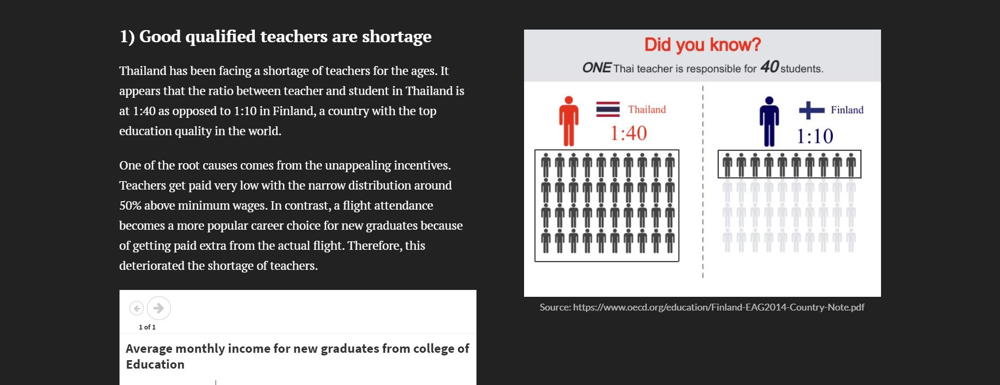

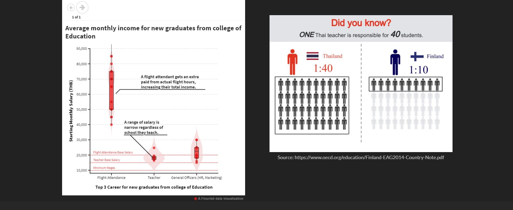

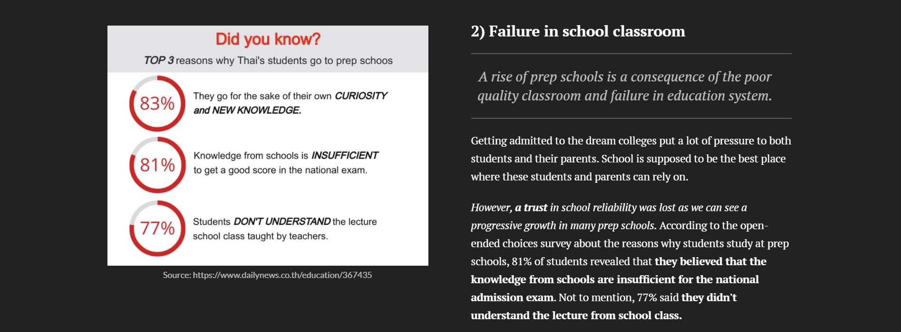

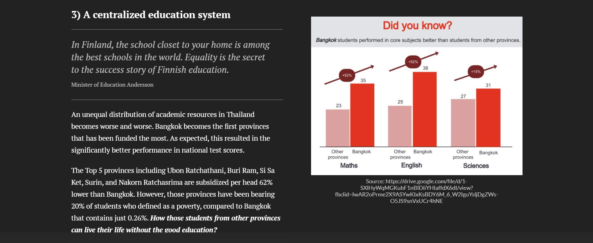

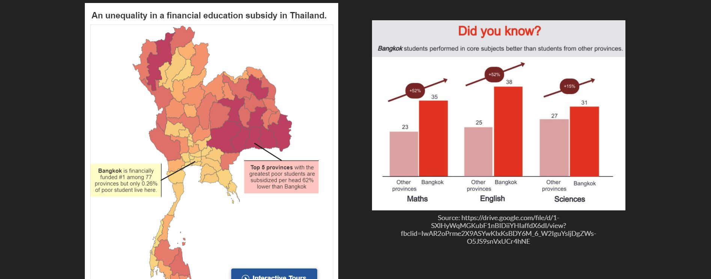

Part 3: How we should improve?

I showed the 4 brief examples of what Finland does differently from Thailand, and end with the big text that draw the audience attention.

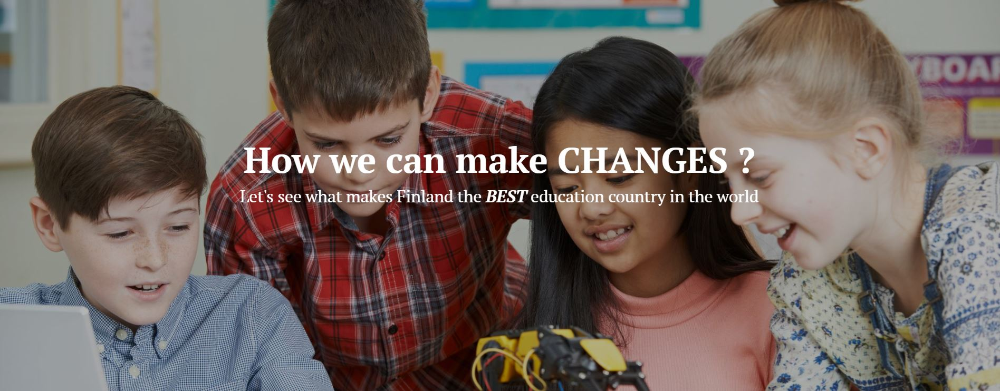

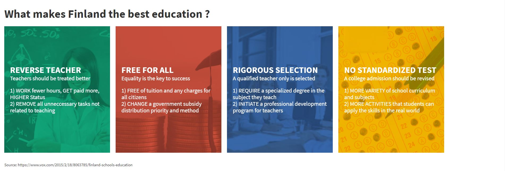

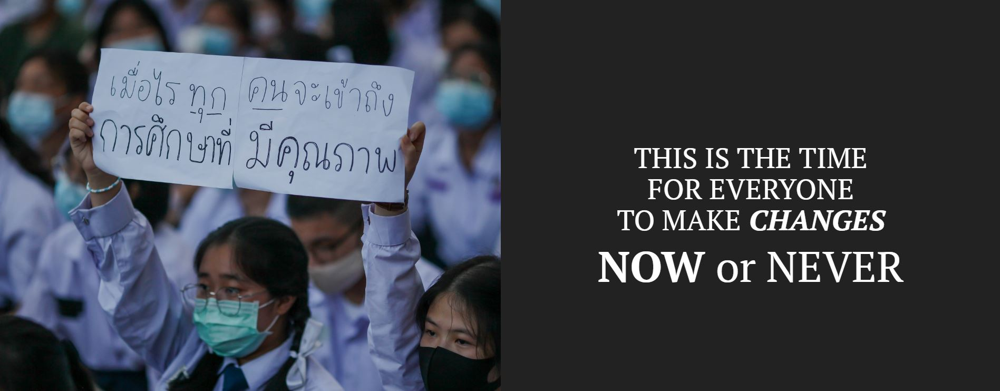

# User Research and Interview

- Protocol

a) the target audience you hope to reach with your story

- General high/middle school students and teachers in Bangkok and nearby

- College students and general public people in Bangkok and nearby

- Parents who have their children in Thai education in Bangkok and nearby

This group of people especially in Bangkok is a good representative because of several reasons. Firtly, Bangkokian has the highest internet/mobilephone penetration rate; therefore, they will be able to share my visualizations and become a talk of the town. Secondly, students/teachers are the first stakeholders who are in the problem cycle, while college students/parents were in the education cycle in the past. Therefore, my visualization speaks up what they feel and resonates to their experiences. Thirdly, my visualization was written in English. Bangkokian is the location where English proficiency is the highest among 77 provinces of Thailand. Therefore, they would understand the key message in my visualization.

b) your approach to identifying representative individuals to interview.

I looked for 3 different people to interview about my website as below;

Person 1: Someone who is familiar with my topic and familiar with Thailand's education

Person 2: Someone who is not familiar with my topic but familiar with Thailand's education

Person 3: Someone who is not familiar with my topic and not familiar with Thailand's education

I also set up metrics 

Metrics 1: Whether the site content is appropriate for my target

Question: Who do you think this site is for?

Metric 2: Whether the key message can be delivered completely

Question: What is the key message you get after you visit my site?, Do you think that the story is smoothly arranged?

Metric 3: Whether the visualization represents the truthfulness and made beautifully

Question: Are there any visualizations that make you confusing or irrelevant?, Are they any visualizations that look messy to you or could have been improved?

Metric 4: Whether the site could motivates the audience to do my call-to-action

Question: Are you likely to share my site on your social media or talk with your friend about the Thai education problem after you visit my site?

c) your interview script.

Brief introduction: "My name is Bank. I'm doing the webpage about Thailand's education".

Very brief discussion of the purpose of today’s test: “My goal today is to get feedback on a new page we're designing. I’m talking to people to see what makes sense and what’s confusing. All feedback is anonymous, and the test should take around 20 minutes of your time. Please remember when I say ‘test’ I mean I’m testing our website and if it is clear or not. There are no wrong answers for you!. So, please share what you think"

"We will go through page by page. I will scroll down to the page and share on the screen. Then, you read, jot down your thought on your paper, and tell me if you want me to keep going to the next page. After we finished up, I will have 5 questions to ask you"

After finishing scrolling up, I started asking the questions listed above.

Question 1: Who do you think this site is for?

Question 2: What is the key message you get after you visit my site?, Do you think that the story is smoothly arranged?

Question 3: Are there any visualizations that make you confusing or irrelevant?, Are they any visualizations that look messy to you or could have been improved?

Question 4: Are you likely to share my site on your social media or talk with your friend about the Thai education problem after you visit my site?

Question 5: What will you do differently if you are the owner of this webpage?

d) the findings from your interviews. 

Question 1: Who do you think this site is for?

Answers: General people who live in Bangkok, Students & Teachers, Authorities in education ministry

Question 2: What is the key message you get after you visit my site?, Do you think that the story is smoothly arranged?

Answers: To identify the root causes and give some examples of good country. Story is arranged smoothly and uniformly.

Question 3: Are there any visualizations that make you confusing or irrelevant?, Are they any visualizations that look messy to you or could have been improved?

Answers:

1) There are 3 points: (1) This graph looks messy. They recommend to remove the control bar (english proficiency and region) because of irrelevance. (2) The audience did not understand why I made a called out at Finland dot. So, it needs a brief introduction why Finland is called out. (3) Some does not know what PISA and OECD abbreviate for ? So, it could be better if I wrote the full name in the first mentioned.

2) Needs to highlight the blue color on Finland if I want to benchmark with it.

3) The graph looks too difficult to understand for someone who has no statistical background. They recommended to use the bar stack chart to represent 2 elements (base salary + extra paid). Also, they recommended to rearrange the page by splitting into 2 parts and put the text/graphs on both side because both graphs have their own story. Last but not least was about the title. It should be changed to Ä shortage of teachers".

4) Word choices on the last reason - "Students DON'T UNDERSTAND the lecture school class taught by teacher". It is confusing whether it is because the students don't understand by themselves or the teachers are under qualified, or teachers could not pay attention. So, it needed to be more clearly on that point.

5) Map visualization looks intimidating. The chart is showing the mismatching between the fund allocation and the number of poor students. The butterfly graph should be used for this scenario. 

6) This page is confusing that it is the policies that Findland has been doing or this is the recommendation that the webpage is recommending. Word choices should be refined.

7) Call to action page is not strong enough. There should be one more page before the summary page that elaborates more clearly on what I want the audience to do. If I want the audience to share this page, it should have a share button attached below the paragraph. Also, there should be an English translation for the picture on the last page.

Question 4: Are you likely to share my site on your social media or talk with your friend about the Thai education problem after you visit my site?

Answer: Yes, but needs one more page to convince what the individual visitor can do.

e) changes you plan on implementing to your visualizations next week to address the issues identified

So, based on the feedbacks that I got, I revised my frameworks and webpage into these. [Click here to see my presentation](https://preview.shorthand.com/2JOYJqMl4ehir3RA)

