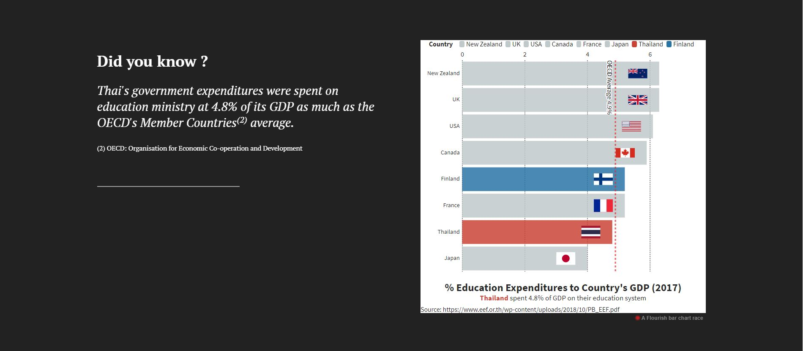

# Changes that I made based on the feedback from the user interview and my thoughts

You can visit my final data story at [Click here to see my Final Presentation] (https://carnegiemellon.shorthandstories.com/ChangeThailandEducation/index.html)

1) Page 1

I changed the title from "CHANGE: A failure of Thailand's Education" to "CHANGE: For a better Thailand's Education" because the initial title was confusing as "change" means "doing something differently".
It should be followed by something that I would like to change. Also, I moved the title to the left side because it would present on the chalk board, which would be something written in the classroom.

2) Page 2

I changed from "What happened to Thai's Education?" to "What happened to Thailand's Education?" because of the word choice.

3) Page 3

I changed 4 things on this page: (1) Added more explanation what PISA Score abbreviates for, (2) Explain the reason why Finland is highlighted?, (3) Removed the English Proficiency and Region Bar on the top because of irrelavance,
and (4) Changed the layout of the page from the text above the visualization to the text placed on the side of visualization.

4) Page 4

I changed 2 things on this page: (1) Highlighted Finland as we already mentioned it from the previous page, (2) Changed the layout of the page to the text placed on the side of visualization.

5) Page 5

I changed the background from the picture of female teacher who was teaching her student to the picture of female student who was depressed (black and white tone) because I would like to make it more dramatic.

6) Page 6

I changed 3 things on this page; (1) I changed the initial layout to 2 charts on the both side with the short text as in the initial version, the 2 charts were placed inappropriately.
(2) The boxplot salary graph looks too complex for the target audience. I changed it to the bar chart and make it simple by showing only the minimum wages; (
(3) The word choices including "Good qualified teachers are shortage"

7) Page 7

I changed the text to be more clear including "Students don't understand the lecture school  class taught by teachers" (this one was not clear whether why students don't understand") to "Students don't understand the lecture school due to the underqualified teachers".
With the new one, it's clear that it is due to the ability of teachers. Another word choice that I changed was from "Failure in classroom" to "A subpar quality of teaching" to be more specific.

8) Page 8

I changed 3 things in this page. (1) I added the Y-Axis on the students performance comparison. (2) I changed from the map chart to the butterfly chart because I would like to highlight the mismatching between the budget allocation and the number of poor students across Thailand.
(3) the layout is changed to the 2 charts are on the both side within 1 page.

9) Page 9

I changed 2 things in this page. (1) The title from "How can we make CHANGES?" to "What does the ideal education look like?" because the key message that I wanted to highlight is just to show what makes Finland the best education country
(2) The background from the American collaboration photo to the Thai student raising their hands to represent the attention of students as the ideal Thailand's education.

10) Page 10

I changed the texts in many spots in the box because these 4 boxes are representing the current policies that Finland is working on. The initial one was confusing because the box is saying "what policy that Thailand should revise", 
but I want to highlight "what makes Finland as the top education country". 

11) Page 11

I added this extra topic to enhance the sympathy and make my call-to-actions more clear on "what you (as a reader) can do?". I selected the bright picture with the positive vibes.

12) Page 12

I split into 2 actions including sharing this story to your social media, and (financially) support the educational organizations. This page role is to make the call-to-actions more clear.
The texts are written by using the emotional phrases to touch upon the reader heart. 

13) Page 13

I changed the background from black color to white color, and some texts. 

I also would like to summary that I learnt along the way in my final project.

**1) Make it simple** - All data visualizations should be digested within a few second. So, the design should be created matching with the target audiences knowledge.

**2) Unity is the key** - All story should be waived with the unity. Don't create the page or waste the time to focus on something that could distract from the key message.

**3) Call-to-action should be described clearly** - Say it clearly what you want the audiences to achieve.

**4) Color can draw the mood and emotion** - Tone and Colors are the key. I should use the color and tone that represents the mood of the webpage, and use the color consistently.

**5) Remove anything irrelevant** - Some data should not be included in the visualization (like in my case, English proficiency or By region are not related to my point).

